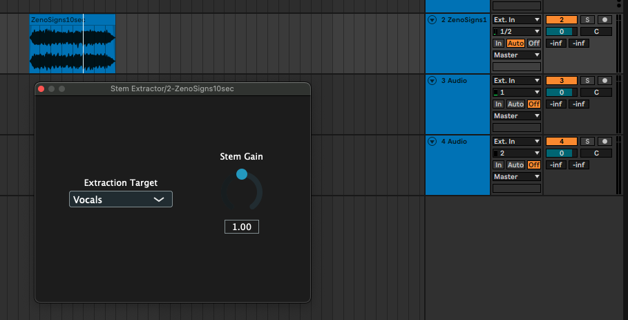
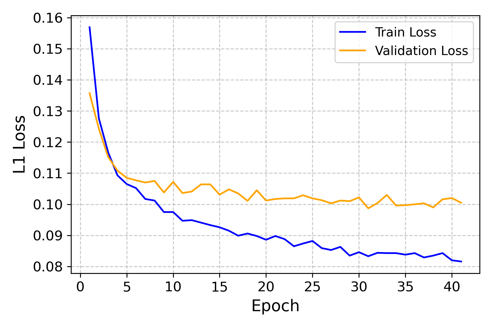
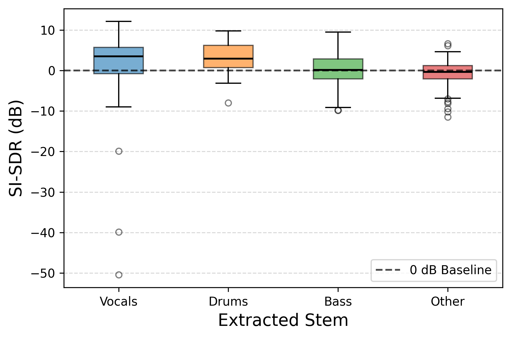

## Stem Extractor VST3

A real-time, AI-powered audio source separation plugin built with PyTorch, ONNX Runtime, and JUCE. This plugin dynamically isolates Vocals, Drums, Bass, and Other instruments from a full mix directly inside your DAW. **Currently installs only on macOS**.

__Plugin Stem Outputs Demo__

<p align="center">
  
</p>

<p align="center">
  <a href="https://youtu.be/xYLYWHUjavo">
    
  </a>
</p>

__Spectrogram Comparison__ (librosa)

<p align="center">
  
</p>

The plugin applies STFT to mask for stems.

### Tech Stack

**Machine Learning:** Python 3.11, PyTorch, Torchaudio, Librosa.

**Audio DSP:** C++17, JUCE Framework, ONNX Runtime.

**Build & Deployment:** CMake, macOS `pkgbuild` (Whitebox).

### Install (macOS)

1. Go to the Releases page and download the latest `Stem.Extractor.pkg` file.
2. Double-clicking the installer will show an "Unverified Developer" warning. To bypass this:
   - Hold Control and click on the .pkg.
   - Select Open from the dropdown.
   - Click Open again.

3. After installation, the VST3 will appear in `Library/Audio/Plugins/` and the AI weights in `Library/Application Support/StemExtractor/` (NOT in ~ Users/yourname/...).
4. Rescan plugins.

**`/ml_pipeline` (Python)**
##### U-Net Convolutional Neural Network trained on the MUSDB18-HQ dataset

- 5-layer Encoder/Decoder U-Net operating on STFT spectrograms.
- Implemented in PyTorch. The model optimises using L1 Loss.

<p align="center">
  
</p>

##### SI-SDR across Full MUSDB18-HQ Test Set

<p align="center">
    
</p>

The baseline U-Net achieves a median SI-SDR of 3.5 dB for Vocals and 2.9 dB for Drums. Output stems corresponding to true stems with no signal (< -60dBFS) are not considered, but there are still extreme negative outliers where the model mistakenly leaks audio into the prediction when there is very subtle true-stem sound.

**`/plugin` (C++)**

- Incoming audio is written to a ring buffer on the audio thread.
- A secondary JUCE thread pulls frames from the FIFO, runs the ONNX inference, applies the output masks to the complex STFT, and reconstructs the audio via Inverse-FFT.

### For Devs

*CMake (3.15+), Python 3.11+ (for training/exporting the ONNX model), macOS with Xcode Command Line Tools installed*

##### 1. Export the Model

```Python
cd ml_pipeline
python export_onnx.py
# Move the resulting stem_extractor.onnx file to /Library/Application Support/StemExtractor/stem_extractor.onnx
```

##### 2. Build the C++ Plugin

```Python
# Configure the build
cmake -B build -S plugin -DCMAKE_BUILD_TYPE=Release

# Compile
cmake --build build --parallel 4

# The .vst3 will be sitting in `build`
```

