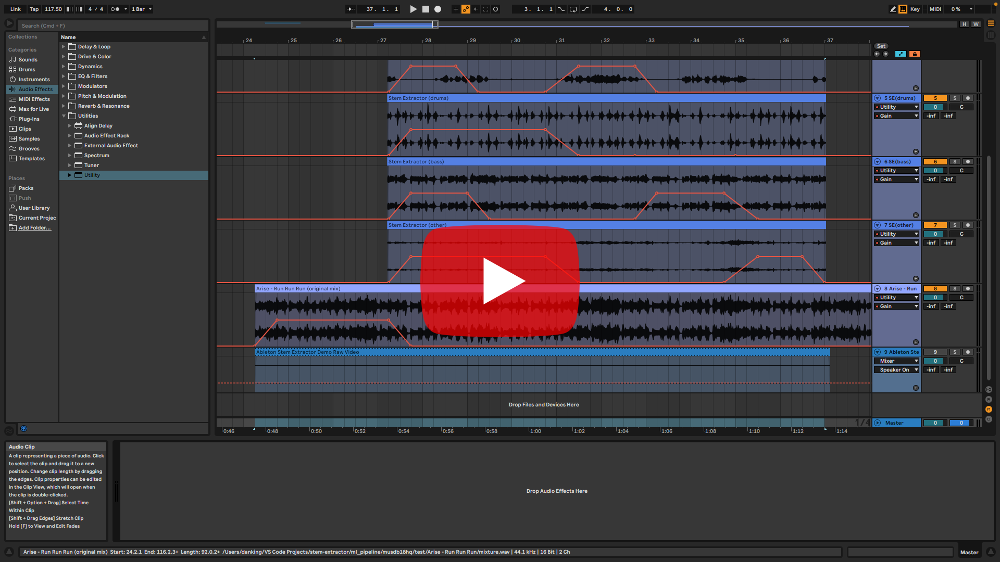

# Stem Extractor VST3

# 🎸 Stem Extractor VST3

A real-time, AI-powered audio source separation plugin built with PyTorch, ONNX Runtime, and JUCE. This VST3 plugin dynamically isolates Vocals, Drums, Bass, and Other instruments from a full mix directly inside your DAW.

[](https://youtu.be/NPQ3ksCOwvk)

## ✨ Features
* **4-Stem Isolation:** Extract Vocals, Drums, Bass, or "Other" in real-time.
* **DAW Integration:** Reports AI inference latency to the DAW (like Ableton Live) for perfect Automatic Delay Compensation (ADC).
* **Cross-Platform C++:** Built with the JUCE framework and CMake.
* **Embedded AI:** The PyTorch model is compiled directly into the VST3 binary—no external model files required.

## 🧠 The Machine Learning Pipeline (`/ml_pipeline`)
The core extraction model is a custom **U-Net Convolutional Neural Network** trained from scratch on the MUSDB18-HQ dataset.

* **Architecture:** 5-layer Encoder/Decoder U-Net operating on complex STFT spectrograms.
* **Training:** Implemented in PyTorch. The model processes audio in precise frame chunks (perfectly divisible by 32 to match the U-Net bottleneck) and optimizes using L1 Loss.
* **Export:** The trained `.pt` weights are exported to a static `.onnx` graph with dynamic time axes, allowing the C++ backend to process sliding windows of audio.

## ⚡ The C++ DSP Architecture (`/plugin`)
Running deep learning inference on a DAW's audio thread will cause instant dropouts. This plugin solves that using a multithreaded architecture:

1. **Lock-Free FIFOs:** Incoming audio is written to a ring buffer on the high-priority audio thread.
2. **Background Inference Thread:** A secondary JUCE Thread wakes up, pulls frames from the FIFO, runs the ONNX inference, applies the output masks to the complex STFT, and reconstructs the audio via Inverse-FFT.
3. **Latency Compensation:** The plugin precisely calculates its buffer requirements and reports the latency to the DAW, ensuring the isolated stems remain perfectly phase-aligned with the rest of the project.

## 🛠️ Building from Source

### Prerequisites
* CMake (3.15+)
* Python 3.11+ (for training/exporting the ONNX model)
* A C++ compiler (Clang/Xcode on macOS, MSVC on Windows)

### 1. Export the Model
First, you must generate the ONNX file so JUCE can bake it into the binary:
```bash
cd ml_pipeline
# Ensure you have your unet_best.pt in this folder
python export_onnx.py ../plugin/stem_extractor.onnx