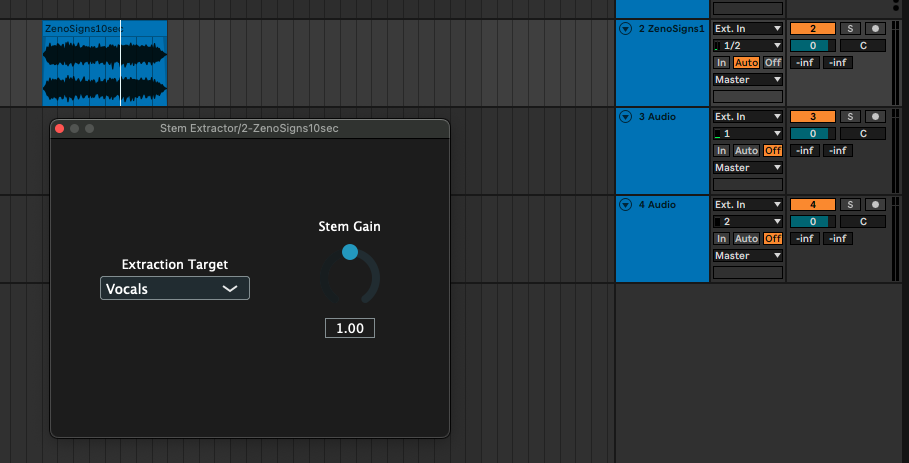
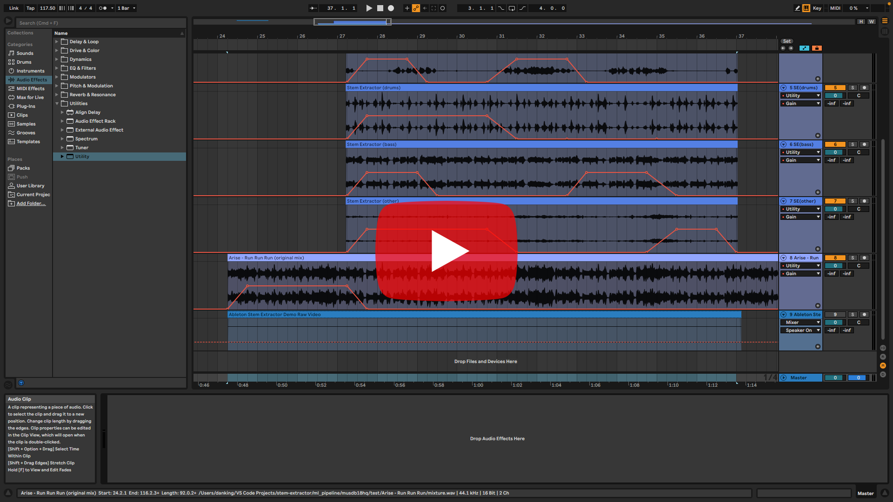
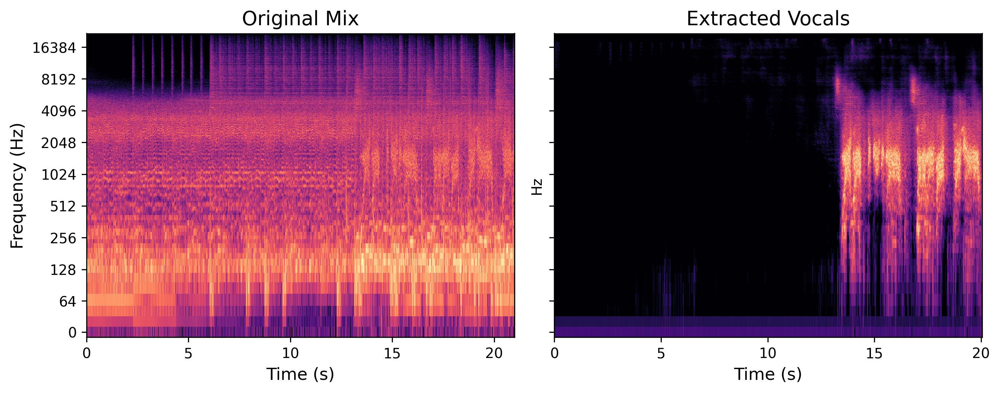
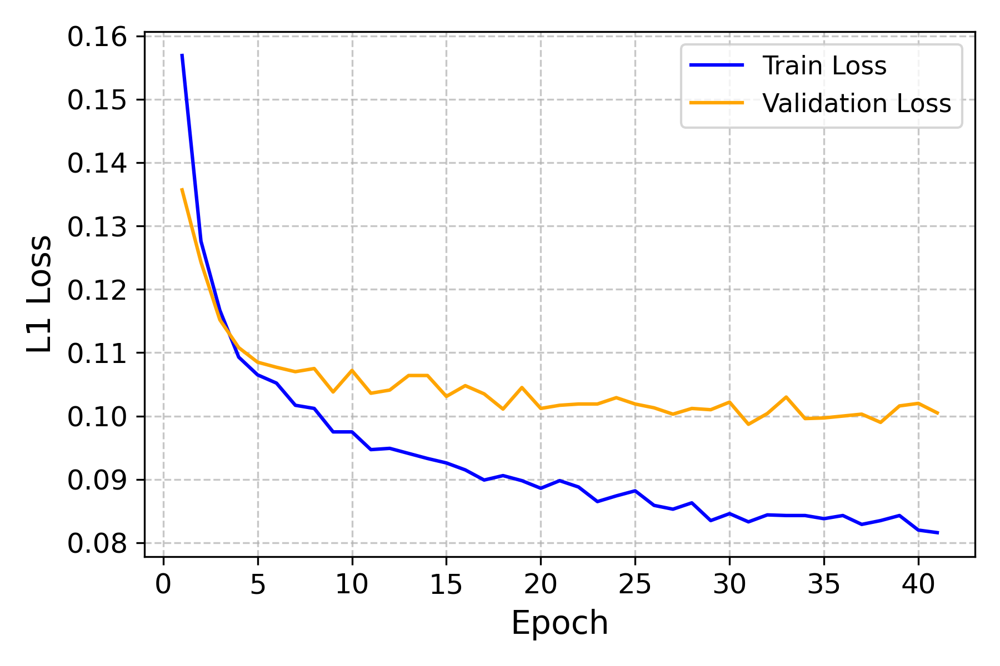
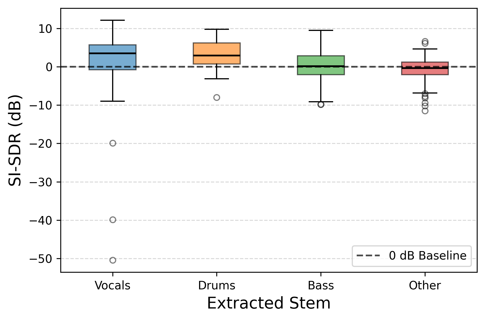
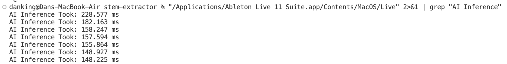

## Stem Extractor VST3

A real-time, AI-powered audio source separation plugin built with PyTorch, ONNX Runtime, and JUCE. This plugin dynamically isolates Vocals, Drums, Bass, and Other instruments from a full mix directly inside your DAW. **Currently installs only on macOS**.

__Plugin Stem Outputs Demo__

  

  

__Spectrogram Comparison__ (librosa)

  

The plugin applies STFT to mask for stems.

#### Train loss

  

#### SI-SDR across Full MUSDB18-HQ Test Set

    

The baseline U-Net achieves a median SI-SDR of 3.5 dB for Vocals and 2.9 dB for Drums. Output stems corresponding to true stems with no signal (< -60dBFS) are not considered, but there are still extreme negative outliers where the model mistakenly leaks audio into the prediction when there is very subtle true-stem sound.

##### AI Inference 

    

